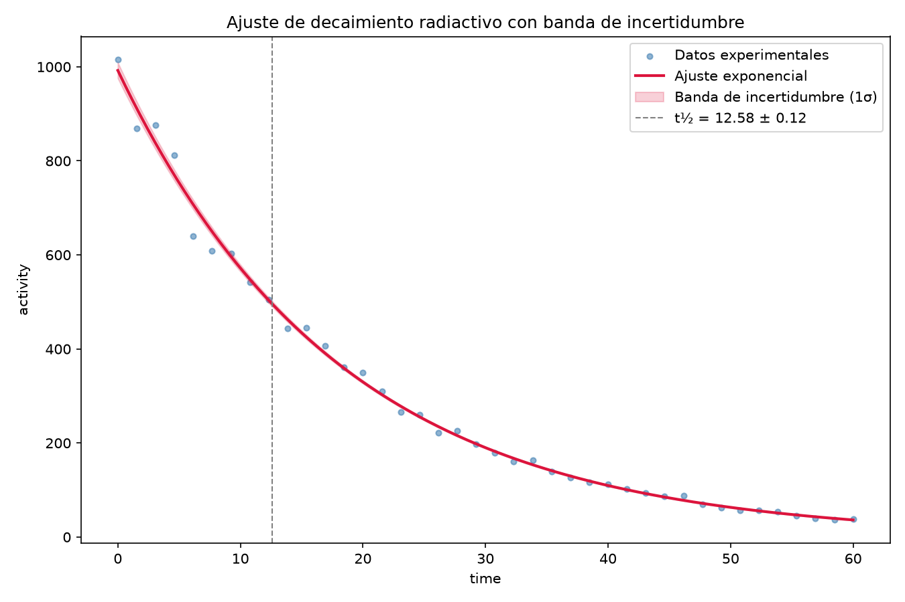

# Radiactive Decay Analysis

A complete statistical analysis of radioactive decay data: from synthetic data generation to non-linear exponential model fitting, with rigorous uncertainy propagation.

## Overview

This project simulates a radioactive decay counting experiment and applies a full scientific data analysis workflow:

1. Synthetic data generation with realistic noise (Poisson/Gaussian-type)
2. Exploratory data analysis (EDA) to validate the physical model
3. Non-linear least-squares fitting (`scipy.optimize.curve_fit`)
4. Half-life calculation with error propagation
5. Final visualization with uncertainty band
6. Reproducible documentation

**Main result:** half-life t½ = **12.58 ± 0.12** time units.

## Physical model

The activity of a radioactive sample follows an exponential decay law:

N(t) = A₀ · e^(−λt)

where:
- `A₀` is the initial activity
- `λ` is the decay constant
- `t` is time

The half-life (time for activity to drop by half) is obtained from:

t½ = ln(2) / λ

## Methodology

### 1. Data generation (`src/generate_data.py`)
Synthetic data is generated following the exponential model with added noise, simulating the statistical variability of a real experimental count. Output: `data/decay_data.csv`.

### 2. Exploratory data analysis (`src/eda.py`)
Data is plotted on both linear and semi-log scales (`figures/eda_linear.png`, `figures/eda_semilog.png`). On a semi-log scale, a pure exponential decay appears as a straight line — this visually confirms that the exponential model is appropriate before fitting any parameters.

### 3. Non-linear fit (`src/fit_model.py`)
`scipy.optimize.curve_fit` is used to fit `A₀` and `λ` via non-linear least squares. In addition to the optimal values, the covariance matrix (`pcov`) is extracted, which contains:
- Each parameter's variance (diagonal) → standard errors
- The cross-covariance `cov(A₀, λ)` (off-diagonal) → needed to propagate uncertainty for any derived quantity that depends on both parameters

The **reduced chi-squared** is also computed as a goodness-of-fit diagnostic:

χ²_reduced = χ² / dof

where `dof` (degrees of freedom) = number of data points − number of fitted parameters. A value close to 1 indicates the model describes the data well given the expected noise; values noticeably below 1 (as obtained here) suggest the assumed data uncertainty is slightly conservative, but do not invalidate the fit.

Results: `results/fit_results.json`.

### 4. Half-life and uncertainty propagation (`src/half_life.py`)
Since `t½` depends **only** on `λ`, error propagation reduces to the single-variable case:

σ(t½) = |∂t½/∂λ| · σ_λ = (ln 2 / λ²) · σ_λ

The cross-covariance term `cov(A₀, λ)` **does not contribute** here, since `∂t½/∂A₀ = 0`.

### 5. Final visualization (`src/plot_final.py`)
For the uncertainty band around the fitted curve `N(t)`, however, the full covariance **is** needed, since `N(t)` depends on both `A₀` and `λ` simultaneously:

σ_N(t)² = (∂N/∂A₀)² σ_{A₀}² + (∂N/∂λ)² σ_λ² + 2 (∂N/∂A₀)(∂N/∂λ) · cov(A₀, λ)

with:

∂N/∂A₀ = e^(−λt)
∂N/∂λ = −A₀ · t · e^(−λt)

Output: `figures/final_fit.png`.

## Results

| Parameter | Value | Uncertainty (1σ) |
|---|---|---|
| A₀ | 992.26 | ± 16.58 |
| λ | 0.05501 | ± 0.00053 |
| t½ | 12.58 | ± 0.12 |
| χ²_reduced | 0.688 | (dof = 38) |



## Repository structure

```
radioactive-decay-analysis/
├── data/
│ └── decay_data.csv
├── figures/
│ ├── eda_linear.png
│ ├── eda_semilog.png
│ └── final_fit.png
├── results/
│ └── fit_results.json
├── src/
│ ├── generate_data.py
│ ├── eda.py
│ ├── fit_model.py
│ ├── half_life.py
│ └── plot_final.py
├── notebooks/
│ └── 01_analysis.ipynb
├── requirements.txt
└── README.md
```

## How to reproduce

```bash
# Clone the repository
git clone https://github.com/YaelRoMa/radioactive-decay-analysis.git
cd radioactive-decay-analysis

# Install dependencies
pip install -r requirements.txt

# Run the full pipeline, in order
python src/generate_data.py
python src/eda.py
python src/fit_model.py
python src/half_life.py
python src/plot_final.py
```

## Technologies used

- Python 3
- NumPy / SciPy (non-linear fitting, error propagation)
- Pandas (data handling)
- Matplotlib (visualization)

## Technical notes

This project places particular emphasis on **statistical rigor**: fitted values are not just reported, but there is an explicit distinction between when the cross-covariance between parameters matters (propagation to `N(t)`) and when it does not (propagation to `t½`), avoiding both the mistake of ignoring relevant correlations and the mistake of over-complicating calculations where they add nothing.

## Author

[Yael R. Maldonado] — [[LinkedIn](https://linkedin.com/in/yael-rodríguez-47210b380/)]